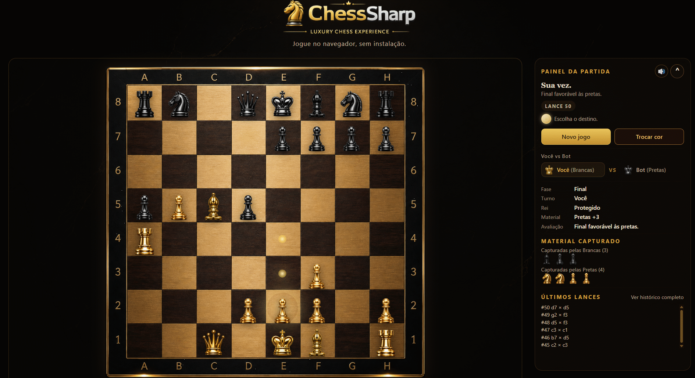
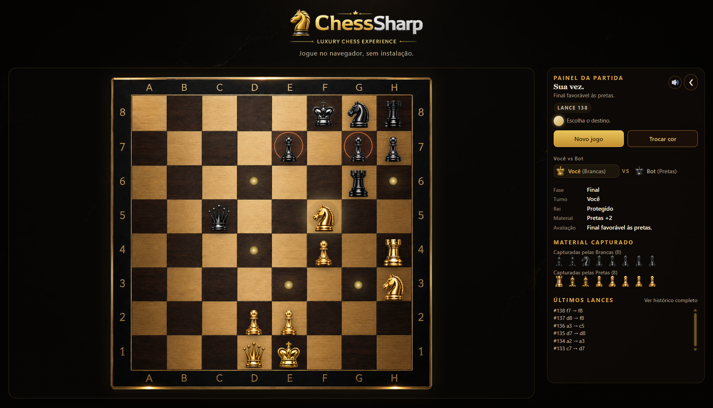
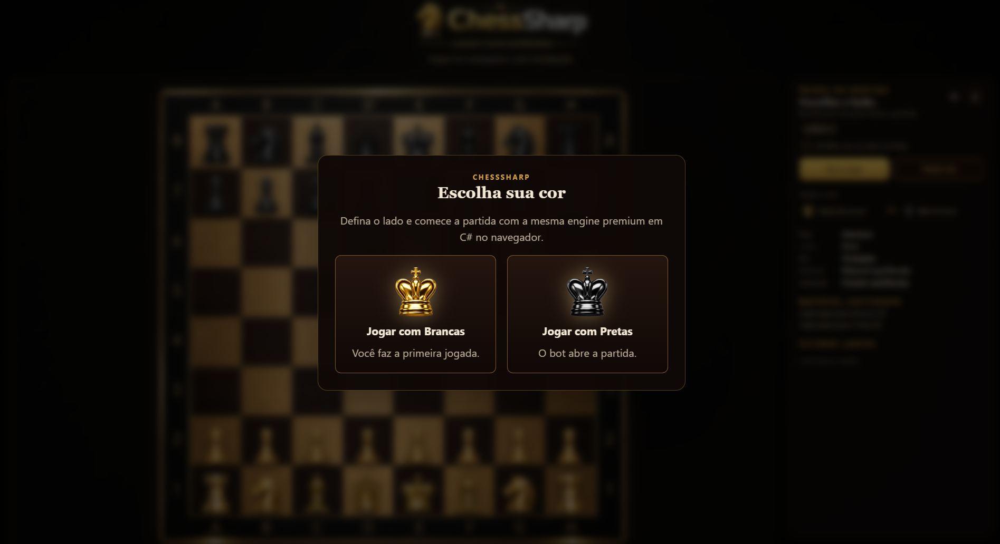
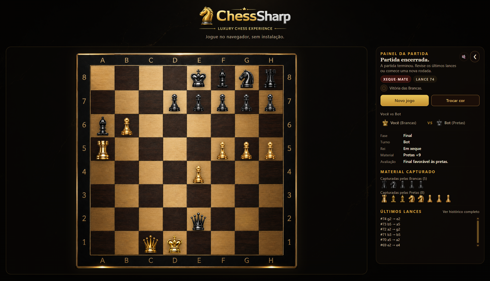
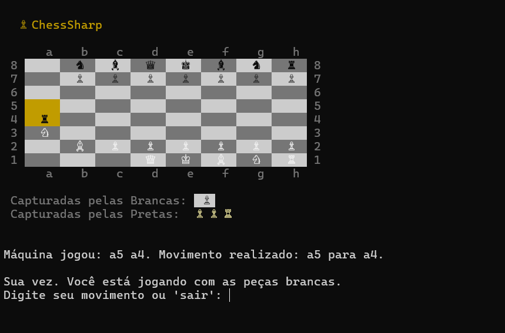

[](https://github.com/felipe-frc/chesssharp/actions/workflows/dotnet-ci.yml)
[](https://github.com/felipe-frc/chesssharp/actions/workflows/dotnet-ci.yml)


# ♟️ ChessSharp

Jogo de xadrez multiplataforma desenvolvido com **C#**, **.NET 9**, **WPF** e **Blazor WebAssembly**, com foco em engine reutilizável, regras reais de xadrez, bot com inteligência artificial, testes automatizados, integração contínua, deploy em nuvem e boas práticas de arquitetura de software.

O projeto conta com uma **engine central em C#** compartilhada entre três versões: **Console**, **Desktop WPF** e **Web com Blazor WebAssembly**. A lógica principal do jogo fica concentrada em `ChessSharp.Core`, enquanto cada interface é responsável apenas pela apresentação, interação e experiência do usuário.

---

## 🎮 Demonstração do Jogo

Veja uma partida em andamento na versão Web, com movimentação de peças, resposta automática do bot, destaques de jogadas legais e painel lateral da partida.

**Caminho do GIF:** `docs/images/chesssharp-gameplay.gif`

<p align="center">
  <a href="https://lively-smoke-05fc65310.7.azurestaticapps.net/">
    
  </a>
</p>

> Clique no GIF para abrir a versão Web publicada no Azure e jogar diretamente no navegador.

---

## 🌐 Acesse o Projeto

🔗 **Deploy:** [ChessSharp Web no Azure](https://lively-smoke-05fc65310.7.azurestaticapps.net/)

📂 **Repositório:** [github.com/felipe-frc/chesssharp](https://github.com/felipe-frc/chesssharp)

📦 **Releases:** [Histórico de versões do ChessSharp](https://github.com/felipe-frc/chesssharp/releases)

> A versão Web está publicada no **Azure Static Web Apps** e pode ser executada diretamente no navegador, sem instalação local.

---

## 📌 Objetivo do Projeto

Este projeto foi desenvolvido com o objetivo de praticar e demonstrar conhecimentos em:

- Desenvolvimento com C# e .NET;
- Programação orientada a objetos aplicada a um domínio com regras complexas;
- Modelagem de entidades, peças, tabuleiro, jogadas e estados de partida;
- Separação entre engine, interface, testes e deploy;
- Construção de uma engine reutilizável entre Console, Desktop e Web;
- Desenvolvimento de interface gráfica com WPF;
- Desenvolvimento Web com Blazor WebAssembly;
- Implementação de regras reais de xadrez;
- Criação de bot com minimax e poda alpha-beta;
- Testes automatizados com xUnit;
- Cobertura de testes com Coverlet;
- Integração contínua com GitHub Actions;
- Deploy em nuvem com Azure Static Web Apps;
- Documentação técnica para portfólio profissional.

---

## ⭐ Destaques Técnicos

- Engine de xadrez centralizada em `ChessSharp.Core`;
- Reaproveitamento da mesma engine nas versões Console, Desktop e Web;
- Arquitetura separada por responsabilidades;
- Regras reais de xadrez implementadas;
- Validação de movimentos legais;
- Detecção de xeque, xeque-mate e afogamento;
- Implementação de roque pequeno, roque grande, promoção de peão e en passant;
- Bot com avaliação material, minimax e poda alpha-beta;
- Interface Desktop em WPF;
- Interface Web em Blazor WebAssembly;
- Tela de escolha de lado na versão Web;
- Painel lateral com turno, fase, material, capturas e histórico;
- Componentização da versão Web;
- Testes automatizados para engine, regras, peças, bot e cenários de partida;
- Pipeline de CI com build, testes e cobertura;
- Deploy público no Azure Static Web Apps;
- Releases incrementais documentando a evolução técnica do projeto.

---

## 🚀 Funcionalidades

### ♟️ Engine do Jogo

- Tabuleiro 8x8;
- Coordenadas no padrão `e2`, `e4`, `h8`;
- Controle de turno entre brancas e pretas;
- Movimentação individual de peão, torre, cavalo, bispo, dama e rei;
- Validação de caminho livre;
- Captura de peças adversárias;
- Bloqueio de captura de peça da mesma cor;
- Bloqueio de jogadas que deixam o próprio rei em xeque;
- Detecção de xeque;
- Detecção de xeque-mate;
- Detecção de afogamento;
- Encerramento correto da partida.

### 🧩 Regras Especiais

- Roque pequeno;
- Roque grande;
- Promoção de peão;
- Promoção com escolha de peça;
- En passant.

### 🤖 Bot

- Geração de movimentos legais;
- Avaliação material do tabuleiro;
- Priorização de capturas;
- Busca com minimax;
- Poda alpha-beta;
- Resposta automática após o movimento do jogador.

### 🌐 Versão Web

- Execução diretamente no navegador;
- Interface construída com Blazor WebAssembly;
- Seleção inicial de lado;
- Tabuleiro premium;
- Peças visuais personalizadas;
- Destaque de movimentos legais;
- Painel lateral com informações da partida;
- Histórico recente de movimentos;
- Exibição de peças capturadas;
- Avaliação de material;
- Modal de promoção;
- Modal de fim de partida;
- Feedback visual para xeque e xeque-mate;
- Feedback sonoro opcional;
- Deploy público no Azure.

### 🖥️ Versão Desktop WPF

- Interface gráfica nativa para Windows;
- Tabuleiro 2D;
- Peças em PNG;
- Interação por clique;
- Destaque de movimentos legais;
- Integração com o bot;
- Uso da mesma engine central do projeto.

### 💻 Versão Console

- Execução pelo terminal;
- Escolha da cor do jogador;
- Entrada por coordenadas;
- Peças em Unicode;
- Histórico textual da partida;
- Exibição de peças capturadas;
- Uso da mesma engine compartilhada.

---

## 🛠️ Tecnologias

| Camada                 | Tecnologia                 |
| ---------------------- | -------------------------- |
| Linguagem              | C#                         |
| Plataforma             | .NET 9                     |
| Engine                 | Class Library em C#        |
| Console                | .NET Console Application   |
| Desktop                | WPF com `net9.0-windows`   |
| Web                    | Blazor WebAssembly         |
| Testes                 | xUnit                      |
| Cobertura              | Coverlet                   |
| Relatório de Cobertura | ReportGenerator            |
| CI/CD                  | GitHub Actions             |
| Deploy                 | Azure Static Web Apps      |
| Versionamento          | Git / GitHub               |
| Documentação           | Markdown + GitHub Releases |

---

## 🏗️ Arquitetura

O projeto utiliza uma organização em camadas para separar responsabilidades, facilitar manutenção e permitir que a mesma engine de xadrez seja utilizada por diferentes interfaces.

```txt
ChessSharp/
│
├── ChessSharp/                  # Interface Console
│   ├── UI/                      # Renderização e interação via terminal
│   ├── ChessSharp.csproj
│   └── Program.cs
│
├── ChessSharp.Core/             # Engine compartilhada do jogo
│   ├── AI/                      # Bot, avaliação e busca de jogadas
│   ├── Board/                   # Tabuleiro, posições e estruturas base
│   ├── Enums/                   # Cores, tipos, estados e enums auxiliares
│   ├── Game/                    # Regras, partida, jogadas e validações
│   ├── Pieces/                  # Peças e regras individuais de movimento
│   └── ChessSharp.Core.csproj
│
├── ChessSharp.Desktop/          # Interface Desktop WPF
│   ├── Assets/                  # Imagens e recursos visuais
│   │   └── Images/
│   ├── App.xaml
│   ├── MainWindow.xaml
│   ├── MainWindow.xaml.cs
│   └── ChessSharp.Desktop.csproj
│
├── ChessSharp.Web/              # Interface Web Blazor WebAssembly
│   ├── Components/              # Componentes visuais reutilizáveis
│   ├── Layout/                  # Layout da aplicação Web
│   ├── Pages/                   # Páginas e code-behind
│   ├── Services/                # Serviços de apresentação
│   ├── ViewModels/              # Modelos de visualização
│   ├── wwwroot/                 # CSS, JavaScript e assets estáticos
│   ├── App.razor
│   ├── Program.cs
│   └── ChessSharp.Web.csproj
│
├── ChessSharp.Tests/            # Testes automatizados
│   ├── AI/
│   ├── Board/
│   ├── Game/
│   ├── Pieces/
│   └── ChessSharp.Tests.csproj
│
├── docs/images/                 # Imagens utilizadas no README
│   ├── chesssharp-checkmate.png
│   ├── chesssharp-color-selection.png
│   ├── chesssharp-console.png
│   ├── chesssharp-gameplay.gif
│   └── chesssharp-web-gameplay.png
│
├── badges/                      # Badge local de cobertura
│   └── coverage.svg
│
├── .github/workflows/           # Pipelines de CI/CD
│
├── ChessSharp.sln
├── LICENSE
└── README.md
```

---

## 🧠 Organização da Engine

A pasta `ChessSharp.Core` concentra toda a lógica principal do jogo. Essa decisão permite que as interfaces Console, Desktop e Web utilizem a mesma base sem duplicar regras.

### `AI/`

Contém a lógica do bot, incluindo avaliação de tabuleiro, escolha de movimentos, minimax e poda alpha-beta.

### `Board/`

Contém estruturas relacionadas ao tabuleiro, posições, casas e representação espacial da partida.

### `Enums/`

Agrupa enumerações utilizadas pela engine, como cor da peça, tipo de peça, estado da partida e classificações auxiliares.

### `Game/`

Contém a orquestração da partida:

- controle de turno;
- aplicação de movimentos;
- validação de jogadas;
- regras especiais;
- detecção de xeque;
- detecção de xeque-mate;
- detecção de afogamento;
- encerramento da partida.

### `Pieces/`

Contém a modelagem das peças e suas respectivas regras de movimento.

Essa organização mantém o domínio isolado da interface visual, facilitando testes, manutenção e evolução do projeto.

---

## 🌐 Organização da Versão Web

A versão Web foi estruturada com **Blazor WebAssembly** e componentização da interface.

```txt
ChessSharp.Web/
│
├── Components/
│   ├── CapturedPieces.razor
│   ├── ChessBoard.razor
│   ├── ChessPiece.razor
│   ├── ChessSquare.razor
│   ├── ColorSelectionModal.razor
│   ├── GamePanel.razor
│   ├── MoveHistory.razor
│   ├── PromotionModal.razor
│   └── SoundToggle.razor
│
├── Pages/
│   ├── Home.razor
│   └── Home.razor.cs
│
├── Services/
│   └── ChessPresentationService.cs
│
├── ViewModels/
│   ├── CapturedPieceView.cs
│   ├── MoveHistoryEntry.cs
│   └── PendingAnimation.cs
│
└── wwwroot/
    ├── assets/
    ├── css/
    └── js/
```

A página principal atua como orquestradora da partida, enquanto componentes e serviços cuidam da apresentação visual, capturas, histórico, peças, tabuleiro, modais e dados auxiliares.

---

## 📸 Interface do Jogo

### 🎮 Partida Web

Versão Web publicada no Azure, com tabuleiro, painel lateral, material capturado, histórico de lances e informações da partida.

**Caminho da imagem:** `docs/images/chesssharp-web-gameplay.png`

<p align="center">
  <a href="docs/images/chesssharp-web-gameplay.png">
    
  </a>
</p>

---

### 🎨 Escolha de Lado

Tela inicial da versão Web, permitindo escolher se o jogador irá jogar com as peças brancas ou pretas.

**Caminho da imagem:** `docs/images/chesssharp-color-selection.png`

<p align="center">
  <a href="docs/images/chesssharp-color-selection.png">
    
  </a>
</p>

---

### 👑 Fim de Partida

Estado de encerramento da partida com identificação de xeque-mate, vencedor e bloqueio de novos movimentos.

**Caminho da imagem:** `docs/images/chesssharp-checkmate.png`

<p align="center">
  <a href="docs/images/chesssharp-checkmate.png">
    
  </a>
</p>

---

### 💻 Versão Console

Versão executada pelo terminal, utilizando a mesma engine do projeto e entrada de movimentos por coordenadas.

**Caminho da imagem:** `docs/images/chesssharp-console.png`

<p align="center">
  <a href="docs/images/chesssharp-console.png">
    
  </a>
</p>

---

## ⚙️ Como Executar

### Pré-requisitos

- [.NET 9 SDK](https://dotnet.microsoft.com/download)
- [Git](https://git-scm.com/)
- Windows para executar a versão Desktop WPF
- VS Code, Visual Studio ou outra IDE compatível com C#

---

### 1. Clone o repositório

```bash
git clone https://github.com/felipe-frc/chesssharp.git
cd chesssharp
```

---

### 2. Restaure as dependências

```bash
dotnet restore ChessSharp.sln
```

---

### 3. Compile a solution

```bash
dotnet build ChessSharp.sln
```

---

### 4. Execute a versão Console

```bash
dotnet run --project ChessSharp/ChessSharp.csproj
```

---

### 5. Execute a versão Desktop WPF

```bash
dotnet run --project ChessSharp.Desktop/ChessSharp.Desktop.csproj
```

> A versão Desktop utiliza WPF e é voltada para execução em ambiente Windows.

---

### 6. Execute a versão Web

```bash
dotnet run --project ChessSharp.Web/ChessSharp.Web.csproj
```

Depois, abra no navegador o endereço exibido no terminal.

Exemplo:

```txt
http://localhost:5290/
```

---

## 🎮 Como Jogar

### Web

- Escolha jogar com as brancas ou com as pretas;
- Clique em uma peça da sua cor;
- Veja os movimentos legais destacados;
- Clique na casa de destino;
- Aguarde o movimento automático do bot;
- Acompanhe capturas, histórico, turno e status no painel lateral;
- Use `Novo jogo` para reiniciar a partida;
- Use `Trocar cor` para abrir uma nova seleção de lado.

### Desktop

- Clique em uma peça da sua cor;
- As casas válidas serão destacadas;
- Clique na casa de destino;
- O bot responde automaticamente;
- A interface atualiza o estado da partida.

### Console

- Escolha a cor do jogador;
- Informe os movimentos no formato `origem destino`;
- Para promoção, informe a peça como terceiro argumento;
- Use `sair` para encerrar a partida.

Exemplos:

```txt
e2 e4
g1 f3
e7 e8 q
```

---

## ✅ Qualidade e Testes

O projeto possui uma suíte de testes automatizados com **xUnit**, focada principalmente na engine compartilhada em `ChessSharp.Core`.

Os testes validam:

- conversão de coordenadas;
- criação e estado inicial do tabuleiro;
- movimentação das peças;
- bloqueio de movimentos inválidos;
- validação de caminho livre;
- capturas;
- alternância de turnos;
- xeque;
- xeque-mate;
- afogamento;
- roque;
- promoção de peão;
- en passant;
- comportamento do bot;
- cenários integrados da partida.

### Executar todos os testes

```bash
dotnet test ChessSharp.sln
```

### Executar apenas o projeto de testes

```bash
dotnet test ChessSharp.Tests/ChessSharp.Tests.csproj
```

### Executar testes com cobertura

```bash
dotnet test ChessSharp.Tests/ChessSharp.Tests.csproj --configuration Release --collect:"XPlat Code Coverage"
```

A pipeline de **GitHub Actions** executa restore, build, testes e geração de cobertura automaticamente, reforçando a confiabilidade da engine e reduzindo o risco de regressões.

---

## 🧠 Decisões de Desenvolvimento

### Engine centralizada em `ChessSharp.Core`

A principal decisão arquitetural do projeto foi isolar a regra de negócio em uma biblioteca própria. Com isso, a engine do jogo não depende de Console, WPF ou Blazor.

Essa separação permite que a mesma lógica seja reaproveitada por múltiplas interfaces, evitando duplicação de regras e facilitando testes automatizados.

### Separação entre domínio e apresentação

As interfaces são responsáveis apenas por interação e apresentação:

- a versão Console cuida da entrada e saída textual;
- a versão Desktop cuida da renderização WPF e eventos de clique;
- a versão Web cuida de componentes, modais, painel lateral e experiência no navegador.

As regras de xadrez permanecem concentradas na engine.

### Componentização da versão Web

A interface Web foi dividida em componentes menores para melhorar legibilidade, manutenção e evolução.

Componentes como `ChessBoard`, `ChessSquare`, `ChessPiece`, `GamePanel`, `CapturedPieces`, `MoveHistory`, `ColorSelectionModal` e `PromotionModal` reduzem a responsabilidade da página principal e tornam a interface mais organizada.

### Serviço de apresentação

A versão Web utiliza `ChessPresentationService` para concentrar cálculos auxiliares de apresentação, como material capturado e avaliação visual da partida.

Essa decisão reduz o acoplamento da página principal e deixa o código mais preparado para futuras evoluções.

### Bot com minimax e poda alpha-beta

O bot foi implementado na engine, não na interface. Isso permite que qualquer versão do projeto utilize a mesma lógica de decisão.

A estratégia considera movimentos legais, avaliação de material e busca por melhores jogadas usando minimax com poda alpha-beta.

### Testes automatizados da engine

Como a engine está separada da interface, os testes conseguem validar regras complexas sem depender de tela, clique ou renderização visual.

Essa abordagem aumenta a confiabilidade do projeto, principalmente em regras sensíveis como xeque, xeque-mate, roque, promoção e en passant.

### Deploy da versão Web no Azure

A versão Web foi publicada no Azure Static Web Apps para facilitar a demonstração do projeto. Isso permite que recrutadores e avaliadores testem a aplicação diretamente pelo navegador, sem precisar clonar ou configurar o ambiente local.

---

## 🧾 Releases

### [v2.7.2 — Refinamentos técnicos da versão Web](https://github.com/felipe-frc/chesssharp/releases/tag/v2.7.2)

Release focada na organização interna do ChessSharp Web, mantendo a experiência visual já estável publicada no Azure.

Principais melhorias:

- Extração de lógica de apresentação para `ChessPresentationService`;
- Movimentação dos cálculos de material para serviço dedicado;
- Organização da lógica de peças capturadas;
- Redução da responsabilidade do `Home.razor.cs`;
- Preservação do comportamento visual da interface Web;
- Preservação das regras, engine, bot e validações.

Validação:

- Build da solution executado com sucesso;
- Testes automatizados executados com sucesso;
- 140 testes aprovados;
- Console, Desktop e Web preservados.

---

### [v2.7.1 — Ajustes finais de layout para deploy no Azure](https://github.com/felipe-frc/chesssharp/releases/tag/v2.7.1)

Release focada em refinamentos visuais da versão Web em Blazor WebAssembly, preparando a interface para publicação no Azure Static Web Apps.

Principais melhorias:

- Correção do painel lateral;
- Histórico recente com rolagem interna;
- Reequilíbrio entre tabuleiro e painel lateral;
- Painel lateral ampliado;
- Responsividade melhorada;
- Hierarquia visual entre os botões `Novo Jogo` e `Trocar Cor`;
- Subtítulo da página simplificado;
- Indicador de turno refinado;
- Preservação da identidade premium em preto, dourado e mármore.

---

### [v2.7.0 — ChessSharp Web com acabamento premium, UX refinada e estabilidade](https://github.com/felipe-frc/chesssharp/releases/tag/v2.7.0)

Release focada na consolidação visual e funcional da versão Web.

Principais melhorias:

- Interface Web com identidade visual premium;
- Nova tela inicial para seleção de cor;
- Painel lateral recolhível;
- Modal de fim de partida;
- Badge visual para xeque e xeque-mate;
- Contador de lances;
- Material capturado reformulado;
- Histórico recente e histórico completo;
- Modal de promoção refinado;
- Sons para movimento, captura, xeque e fim de partida;
- Correção de textos e encoding UTF-8;
- Melhorias gerais de layout, tipografia e estabilidade.

---

### [v2.6.0 — Refatoração arquitetural e consolidação multiplataforma](https://github.com/felipe-frc/chesssharp/releases/tag/v2.6.0)

Release focada em reorganizar a base do projeto e consolidar `ChessSharp.Core` como centro da engine compartilhada.

Principais melhorias:

- Centralização física da engine em `ChessSharp.Core`;
- Reorganização da solution;
- Padronização das referências entre projetos;
- Componentização da versão Web;
- Separação entre UI e regra de negócio;
- Melhor organização de estilos;
- Melhoria da compatibilidade com a pipeline de CI;
- Atualização da documentação para refletir a arquitetura real.

---

### [v2.5.0 — ChessSharp Web estável no navegador](https://github.com/felipe-frc/chesssharp/releases/tag/v2.5.0)

Release focada em consolidar a experiência Web do ChessSharp com Blazor WebAssembly.

Principais melhorias:

- Versão Web jogável no navegador;
- Seleção de cor;
- Histórico recente;
- Histórico completo;
- Capturas separadas por cor;
- Animação curta de movimento;
- Feedback sonoro opcional;
- Integração com a mesma engine em C#.

---

### [v2.4.0 — Otimização visual e cache de assets](https://github.com/felipe-frc/chesssharp/releases/tag/v2.4.0)

Release focada em melhorar carregamento, reaproveitamento de imagens e organização dos assets visuais.

---

### [v2.3.0 — Refinamento do footer e feedback visual](https://github.com/felipe-frc/chesssharp/releases/tag/v2.3.0)

Release focada no polimento visual da interface Desktop, refinando footer, botões de ação, painel de status e feedback de seleção.

---

### [v2.2.0 — Fundo premium e refinamento da interface Desktop](https://github.com/felipe-frc/chesssharp/releases/tag/v2.2.0)

Release focada na atmosfera visual da interface Desktop, com fundo premium e refinamento geral da tela.

---

### [v2.1.0 — Tabuleiro premium e refinamento visual do jogo](https://github.com/felipe-frc/chesssharp/releases/tag/v2.1.0)

Release focada na evolução visual do tabuleiro e das peças.

---

### [v2.0.0 — Interface gráfica 2D com WPF](https://github.com/felipe-frc/chesssharp/releases/tag/v2.0.0)

Release que adicionou a primeira interface gráfica Desktop em WPF, com movimentação por mouse e integração com o bot.

---

### [v1.7.0 — En passant](https://github.com/felipe-frc/chesssharp/releases/tag/v1.7.0)

Release focada na implementação da regra especial en passant.

---

### [v1.6.0 — Cobertura de testes com badge](https://github.com/felipe-frc/chesssharp/releases/tag/v1.6.0)

Release focada em adicionar cobertura de testes com Coverlet e badge no README.

---

### [v1.5.0 — Bot com minimax simples](https://github.com/felipe-frc/chesssharp/releases/tag/v1.5.0)

Release focada na evolução da inteligência do bot, com avaliação de tabuleiro, minimax e poda alpha-beta.

---

### [v1.4.0 — Roque e promoção de peão](https://github.com/felipe-frc/chesssharp/releases/tag/v1.4.0)

Release focada na implementação das regras especiais de roque e promoção.

---

### [v1.3.0 — Xeque e xeque-mate real](https://github.com/felipe-frc/chesssharp/releases/tag/v1.3.0)

Release focada na substituição da lógica simplificada de captura do rei por detecção real de xeque e xeque-mate.

---

### [v1.2.0 — Escolha de cor do jogador](https://github.com/felipe-frc/chesssharp/releases/tag/v1.2.0)

Release que adicionou a possibilidade de escolher jogar com as peças brancas ou pretas.

---

### [v1.1.0 — Melhorias visuais no tabuleiro](https://github.com/felipe-frc/chesssharp/releases/tag/v1.1.0)

Release focada na melhoria visual do ChessSharp no Console, com casas coloridas e peças Unicode.

---

### [v1.0.0 — Versão inicial jogável no Console](https://github.com/felipe-frc/chesssharp/releases/tag/v1.0.0)

Primeira versão jogável do ChessSharp, com tabuleiro, peças, movimentação, jogador contra máquina, bot simples, testes automatizados e integração contínua.

---

## 📈 Melhorias Futuras

- Adicionar GIF curto de gameplay no README;
- Criar níveis de dificuldade para o bot;
- Melhorar a avaliação posicional da IA;
- Adicionar modo jogador contra jogador;
- Adicionar regras adicionais de empate;
- Salvar histórico completo de partidas;
- Adicionar persistência de estatísticas;
- Ampliar testes estratégicos do bot;
- Refinar ainda mais a separação entre UI e serviços de apresentação;
- Adicionar domínio personalizado para o deploy.

---

## 📄 Licença

Este projeto está sob a licença MIT. Veja o arquivo [LICENSE](LICENSE) para mais detalhes.

---

## 👨🏻‍💻 Autor

**Marcos Felipe França**

[LinkedIn](https://www.linkedin.com/in/marcosfelipefrc) · [GitHub](https://github.com/felipe-frc)
